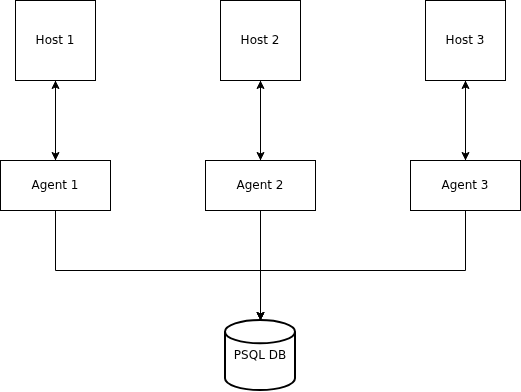

Linux Cluster Monitoring Agent
==============================

# Introduction
This project aims to allow the monitoring of a Linux cluster. In other words, it should allow a user
 to run a monitoring agents that will retrieve system usage information for every host in the 
cluster and store it in a PostgreSQL database.

The user could be a member of the Linux Cluster Administration team.

The implementation uses bash scripts, a PostgreSQL database and docker, with everything being 
organized using git for version control.

# Quick Start
- Start a psql instance using ```./scripts/psql_docker.sh start|stop|create 
[db_username][db_password]```
- Create tables using ```psql -h localhost -U postgres -d host_agent -f sql/ddl.sql```
- Insert hardware specs data into the DB using ```./scripts/host_info.sh psql_host psql_port db_name
psql_user psql_password```
- Insert hardware usage data into the DB using ```./scripts/host_usage.sh psql_host psql_port db_name 
psql_user psql_password```
- Automate usage monitoring using ```crontab -e``` and writing to the file ```* * * * * bash 
/home/centos/dev/jrvs/bootcamp/linux_sql/host_agent/scripts/host_usage.sh localhost 5432 host_agent 
postgres password > /tmp/host_usage.log```

# Implementation
## Architecture


## Scripts
- ```psql_docker.sh```: Contains the logic to either create, start or stop the docker psql container. 
Start a psql instance using ```./scripts/psql_docker.sh start|stop|create 
[db_username][db_password]```
- ```ddl.sql```: Contains the logic to create the two tables ```host_info``` and ```host_usage``` where
  the appropriate data will be stored. Create tables using 
```psql -h localhost -U postgres -d host_agent -f sql/ddl.sql```
- ```host_info.sh```: Contains the logic to retrieves information about the hardware of the host 
system. Insert hardware specs data into the DB using 
```./scripts/host_info.sh psql_host psql_port db_name psql_user psql_password```
- ```host_usage.sh```: Contains the logic to retrieve information about the system usage of the host 
system. Insert hardware usage data into the DB using 
```./scripts/host_usage.sh psql_host psql_port db_name psql_user psql_password```
- crontab can be used to automate the execution of ```host_usage.sh```. Automate usage monitoring 
using ```crontab -e``` and writing to the file ```* * * * * bash 
/home/centos/dev/jrvs/bootcamp/linux_sql/host_agent/scripts/host_usage.sh localhost 5432 host_agent 
postgres password > /tmp/host_usage.log```
- ```queries.sql```: ```TODO```

## Database Modeling
### <center> host_info </center>
| id | hostname                           | cpu_number | cpu_architecture | cpu_model                        | cpu_mhz  | l2_cache | "timestamp"               | total_mem |
|----|------------------------------------|------------|------------------|----------------------------------|----------|----------|---------------------------|-----------|
| 1  | 'spry-framework-236416.internal'   | 1          | 'x86_64'         | 'Intel(R) Xeon(R) CPU @ 2.30GHz' | 2300.000 | 256      | '2019-05-29 17:49:53.000' | 601324    |

### <center> host_usage </center>
| "timestamp"               | hostid | memory_free | cpu_idle | cpu_kernel | disk_io | disk_available |
|---------------------------|--------|-------------|----------|------------|---------|----------------|
| '2019-05-29 17:49:53.000' | 1      | 256         | 90       | 4          | 0       | 31220          |

# Test
Tested by running ```psql_docker.sh```,  ```ddl.sql```, ```host_info.sh``` and then 
```host_usage.sh```. Then connecting to the psql DB using 
```psql -h localhost -p 5432 -d host_agent -U postgres``` and running ```SELECT * FROM host_info;```
 and ```SELECT * FROM host_info;``` to verify new rows have been added.

# Deployment
Remote repository for version control at https://github.com/jarviscanada/jarvis_data_eng_GuillaumePregent.
App is deployed using docker and crontab.

# Improvements
- Current implementation does not support hardware updates
- Create master script which allows entire project to be run with a single command
- Create user interface for better user experience

